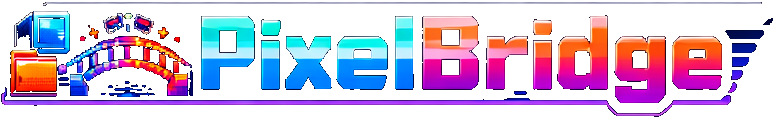

# PixelBridge - RetroArch ROM Library Manager



**PixelBridge** is a modern web-based ROM library manager that bridges your retro gaming collection to RetroArch on Apple TV. Upload, organize, and sync your ROMs with automatic metadata fetching from IGDB.

## ✨ Features

- 🎮 **Multi-Platform Support** - 25+ retro gaming platforms (NES, SNES, PlayStation, etc.)
- 📚 **Smart Library Management** - Browse ROMs by platform with cover art and metadata
- 🔄 **Automatic Metadata** - Game info, covers, and details from IGDB API
- 📺 **Apple TV Sync** - Direct push to RetroArch via WebUI with save game backup
- 💾 **Save Game Management** - Automatic backup and restore of game saves
- 📋 **Playlist Generation** - Auto-generated RetroArch playlists
- ⭐ **Favorites System** - Mark and filter your favorite games
- 🎨 **Pixel Art UI** - Retro-themed interface with "Press Start 2P" font
- 🐳 **Docker Ready** - One-command deployment with Docker Compose

## 🏗️ Architecture

```
┌─────────────────────────────────────────────┐
│        Frontend (React + Vite)              │
│  - ROM Browser with Grid View               │
│  - Platform Filtering                       │
│  - Upload Interface                         │
│  - Apple TV Connection Status               │
└─────────────────┬───────────────────────────┘
                  │ REST API
┌─────────────────▼───────────────────────────┐
│         Backend (Node.js + Express)         │
│  - ROM CRUD Operations                      │
│  - File Upload & Processing                 │
│  - IGDB Metadata Integration                │
│  - RetroArch WebUI Client                   │
│  - Complete Sync Workflow                   │
└──────┬────────────────────┬─────────────────┘
       │                    │
┌──────▼──────┐    ┌────────▼─────────────────┐
│   SQLite    │    │  File System Storage     │
│  Database   │    │  - ROMs (by platform)    │
│             │    │  - Cover Images          │
└─────────────┘    │  - Save Game Backups     │
                   └──────────────────────────┘
                             │
                   ┌─────────▼──────────────────┐
                   │ RetroArch WebUI (Apple TV) │
                   │  - File Upload             │
                   │  - Playlist Management     │
                   └────────────────────────────┘
```

## 🚀 Quick Start with Docker

### Prerequisites

- Docker & Docker Compose installed
- RetroArch on Apple TV with WebUI enabled
- IGDB API credentials (Twitch Developer Account)

### 1. Get IGDB API Credentials

1. Create a [Twitch Developer Account](https://dev.twitch.tv/)
2. Register a new application
3. Copy your **Client ID** and **Client Secret**
4. Generate an access token:

```bash
curl -X POST 'https://id.twitch.tv/oauth2/token' \
  -d 'client_id=YOUR_CLIENT_ID' \
  -d 'client_secret=YOUR_CLIENT_SECRET' \
  -d 'grant_type=client_credentials'
```

Save the `access_token` from the response.

### 2. Configure Environment

```bash
# Copy example environment file
cp .env.example .env

# Edit .env and add your credentials
nano .env
```

**Required settings in `.env`:**

```bash
# IGDB API (required for metadata)
IGDB_CLIENT_ID=your_twitch_client_id_here
IGDB_ACCESS_TOKEN=your_access_token_here

# Apple TV IP (can be changed via Settings UI)
RETROARCH_IP=192.168.6.125
RETROARCH_PORT=80
```

### 3. Start with Docker Compose

```bash
# Build and start containers
docker-compose up -d

# Check logs
docker-compose logs -f

# Stop containers
docker-compose down

# Stop and remove volumes (deletes all data!)
docker-compose down -v
```

### 4. Access the Application

- **Web UI**: http://localhost
- **API**: http://localhost:3000/api
- **Health Check**: http://localhost:3000/api/health

## 📦 Deployment

### Docker Compose (Recommended)

The application uses Docker volumes for persistence:

- `pixelbridge-storage` - ROMs, covers, metadata, save backups
- `pixelbridge-database` - SQLite database

**To backup your data:**

```bash
# Backup storage volume
docker run --rm -v pixelbridge-storage:/data -v $(pwd):/backup alpine tar czf /backup/storage-backup.tar.gz /data

# Backup database volume
docker run --rm -v pixelbridge-database:/data -v $(pwd):/backup alpine tar czf /backup/database-backup.tar.gz /data
```

**To restore:**

```bash
# Restore storage
docker run --rm -v pixelbridge-storage:/data -v $(pwd):/backup alpine tar xzf /backup/storage-backup.tar.gz -C /

# Restore database
docker run --rm -v pixelbridge-database:/data -v $(pwd):/backup alpine tar xzf /backup/database-backup.tar.gz -C /
```

### Custom Volume Paths

To use custom paths instead of Docker volumes, edit `docker-compose.yml`:

```yaml
volumes:
  # Replace named volumes with bind mounts
  - ./data/storage:/app/storage
  - ./data/database:/app/database
```

### Environment Variables

All configuration is done via `.env` file:

| Variable | Default | Description |
|----------|---------|-------------|
| `RETROARCH_IP` | `192.168.6.125` | Apple TV IP address |
| `RETROARCH_PORT` | `80` | RetroArch WebUI port |
| `IGDB_CLIENT_ID` | - | **Required** - Twitch Client ID |
| `IGDB_ACCESS_TOKEN` | - | **Required** - IGDB Access Token |
| `DATABASE_PATH` | `/app/database/retroarch.db` | SQLite database path |
| `STORAGE_PATH` | `/app/storage` | Base storage directory |
| `MAX_FILE_SIZE` | `4294967296` | Max upload size (4GB) |
| `CORS_ORIGIN` | `http://localhost` | Frontend origin for CORS |

## 🎮 RetroArch Apple TV Setup

### Enable WebUI in RetroArch

1. Start RetroArch on Apple TV
2. Go to **Settings → Network**
3. Enable **Network Commands**
4. Enable **Web User Interface**
5. Note the displayed IP address
6. Click on **OFFLINE** status in PixelBridge to configure the IP

### Sync Workflow

The complete sync process:

1. **Phase 1**: Backup current save games from Apple TV
2. **Phase 2**: Clear old ROMs and playlists
3. **Phase 3**: Upload selected ROMs
4. **Phase 4**: Generate fresh playlists
5. **Phase 5**: Restore save games

## 📖 Usage Guide

### Uploading ROMs

1. Navigate to **Upload** page
2. Drag & drop ROM files (supports `.zip`, `.nes`, `.snes`, `.iso`, etc.)
3. Platform is auto-detected from file extension
4. Metadata is automatically fetched from IGDB
5. ROMs appear in library organized by platform

### Syncing to Apple TV

1. Ensure Apple TV is **ONLINE** (green status indicator)
2. Select ROMs using checkboxes
3. Click **"Push to Apple TV"**
4. Monitor sync progress with detailed phase updates
5. Launch RetroArch and enjoy!

### Managing ROMs

- **View Details**: Click info icon (ℹ️) on ROM card
- **Add to Favorites**: Click heart icon in ROM details
- **Delete ROM**: Click delete button in ROM details
- **Filter by Platform**: Use platform buttons at top
- **Save Indicator**: Diskette icon shows backed-up saves

## 🛠️ Development

### Local Development (Without Docker)

**Backend:**

```bash
cd backend
npm install
npm run migrate  # Initialize database
npm run seed     # Add platform data
npm run dev      # Start with nodemon
```

**Frontend:**

```bash
cd frontend
npm install
npm run dev      # Start Vite dev server
```

### Project Structure

```
RetroArch_Addon/
├── backend/
│   ├── src/
│   │   ├── config/          # Configuration & constants
│   │   ├── controllers/     # Request handlers
│   │   ├── services/        # Business logic
│   │   ├── models/          # Database models
│   │   ├── routes/          # API routes
│   │   ├── middleware/      # Express middleware
│   │   ├── utils/           # Helper functions
│   │   └── database/        # Migrations & seeds
│   ├── storage/             # File storage (volumes)
│   ├── Dockerfile
│   └── server.js
├── frontend/
│   ├── src/
│   │   ├── api/             # API clients
│   │   ├── components/      # React components
│   │   ├── pages/           # Page components
│   │   ├── store/           # Zustand state
│   │   └── styles/          # CSS
│   ├── public/              # Static assets
│   ├── Dockerfile
│   ├── nginx.conf
│   └── vite.config.js
├── docker-compose.yml
├── .env.example
└── README.md
```

## 🐛 Troubleshooting

### Apple TV Shows Offline

1. Click on **OFFLINE** status to open settings
2. Verify Apple TV IP address
3. Ensure RetroArch WebUI is enabled
4. Check network connectivity
5. Test connection in settings modal

### ROMs Not Uploading

- Check file size (max 4GB by default)
- Verify file extension is supported
- Check backend logs: `docker-compose logs backend`
- Ensure storage volume has space

### Metadata Not Fetching

- Verify IGDB credentials in `.env`
- Check access token validity (expires after ~60 days)
- Regenerate token if expired
- Check backend logs for API errors

### Database Issues

```bash
# Reset database (deletes all data!)
docker-compose down -v
docker-compose up -d

# Or manually:
docker exec -it pixelbridge-backend sh
rm /app/database/retroarch.db
node src/database/migrate.js
```

## 🔒 Security Notes

- **API Keys**: Never commit `.env` file to git
- **Network**: Application should run on trusted local network
- **File Uploads**: Validated by extension and size limits
- **Docker**: Runs as non-root user for security

## 📝 API Documentation

### Key Endpoints

- `GET /api/platforms` - List all platforms
- `GET /api/roms` - List all ROMs (with filters)
- `POST /api/upload` - Upload ROM files
- `POST /api/retroarch/sync` - Complete sync workflow
- `GET /api/retroarch/status` - Check Apple TV connection
- `PUT /api/settings` - Update settings
- `PATCH /api/roms/:id/favorite` - Toggle favorite

Full API docs available at: http://localhost:3000/api

## 🤝 Contributing

Contributions welcome! Please:

1. Fork the repository
2. Create a feature branch
3. Test thoroughly
4. Submit a pull request

## 📄 License

MIT License - See LICENSE file for details

## 🙏 Credits

- **IGDB API** - Game metadata
- **RetroArch** - Multi-platform emulation
- **Press Start 2P Font** - Pixel-art typography

## 🔗 Links

- [IGDB API Documentation](https://api-docs.igdb.com/)
- [RetroArch Documentation](https://docs.libretro.com/)
- [Twitch Developer Portal](https://dev.twitch.tv/)

---

**PixelBridge** - Bridge your retro gaming library to the modern era 🎮✨
