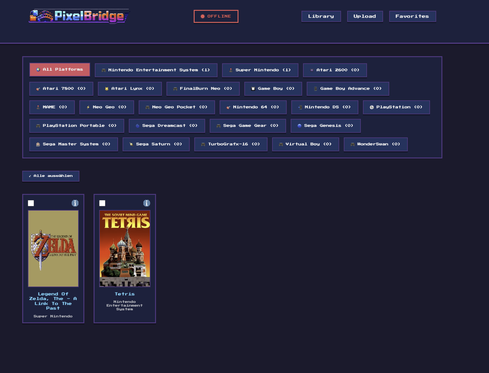
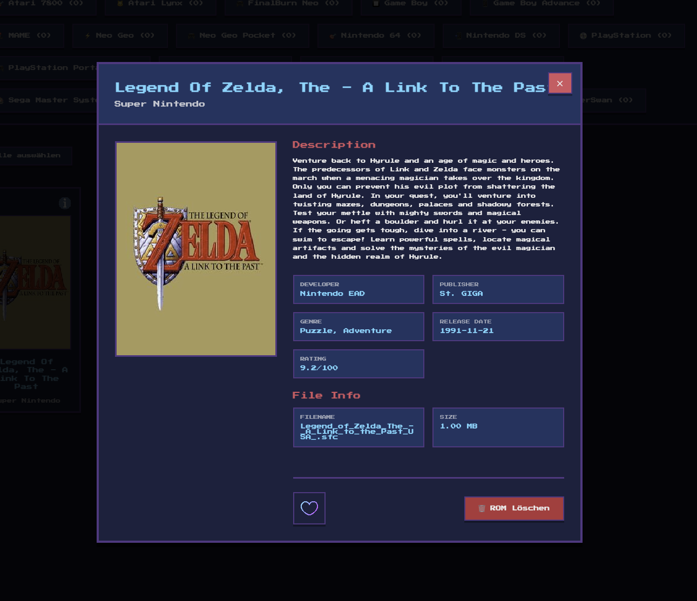
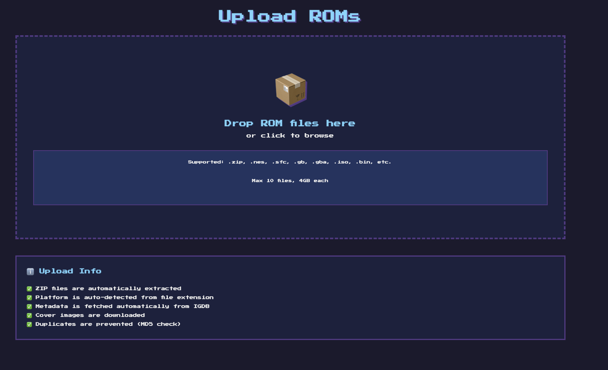

<div align="center">


# PixelBridge

**Modern Web-Based ROM Library Manager for RetroArch**

[](https://hub.docker.com/r/virus250188/pixelbridge)
[](LICENSE)
[](https://www.docker.com/)

Bridge your retro gaming collection to RetroArch on Apple TV with automatic metadata, cover art, and seamless synchronization.

[Features](#-features) • [Screenshots](#-screenshots) • [Quick Start](#-quick-start) • [Installation](#-installation)

</div>

---

## ✨ Features

### 🎮 Core Features
- **25+ Gaming Platforms** - Support for NES, SNES, PlayStation, Game Boy, and more
- **Smart Library Management** - Browse and organize your ROM collection with beautiful cover art
- **Automatic Metadata** - Fetch game information and cover images from IGDB database
- **Apple TV Sync** - Direct push to RetroArch via WebUI with complete workflow automation
- **Save Game Backup** - Automatic backup and restore of game saves during sync
- **Favorites System** - Mark and filter your favorite games

### 🛠️ Technical Highlights
- **One-Click Deployment** - Single Docker container with frontend, backend, and nginx
- **Unraid Compatible** - Perfect for Unraid setups with easy configuration
- **Modern UI** - Pixel-art themed interface built with React
- **RESTful API** - Clean API for ROM management and RetroArch integration
- **SQLite Database** - Lightweight, file-based database with volume persistence
- **Automatic Cleanup** - Smart cleanup of orphaned files

---

## 📸 Screenshots

### Main Library

*Browse your entire ROM collection with cover art*

### Game Information

*View detailed game information and metadata*

### Upload & Metadata

*Upload ROMs and automatically fetch metadata*

### Apple TV Settings

*Configure RetroArch Apple TV connection*

---

## 🚀 Quick Start

### Prerequisites
- Docker installed ([Get Docker](https://docs.docker.com/get-docker/))
- RetroArch on Apple TV with WebUI enabled
- IGDB API credentials ([Get free credentials](#getting-igdb-credentials))

### Unraid Installation (Recommended)

1. **Add Container** in Unraid Docker tab
2. **Repository**: `virus250188/pixelbridge:latest`
3. **Network Type**: Bridge
4. **Port**: `80` → Host Port: `1234` (or your preferred port)
5. **Add Volume**:
   - Container Path: `/app/backend/storage`
   - Host Path: `/mnt/user/appdata/pixelbridge/`
6. **Add Variables**:
   - `STORAGE_PATH` = `/app/backend/storage`
   - `RETROARCH_IP` = `192.168.x.x` (your Apple TV IP)
   - `IGDB_CLIENT_ID` = your client ID
   - `IGDB_CLIENT_SECRET` = your client secret
7. **Apply** and start!

See [UNRAID_SETUP.md](UNRAID_SETUP.md) for detailed instructions.

### Docker Run (Standard)

```bash
docker run -d \
  --name pixelbridge \
  --restart unless-stopped \
  -p 80:80 \
  -v /path/to/storage:/app/backend/storage \
  -e STORAGE_PATH=/app/backend/storage \
  -e RETROARCH_IP=192.168.1.100 \
  -e IGDB_CLIENT_ID=your_client_id \
  -e IGDB_CLIENT_SECRET=your_client_secret \
  virus250188/pixelbridge:latest
```

Then open `http://localhost` (or `http://your-server-ip:port`) in your browser.

---

## 📦 Installation

### Docker Compose (Advanced)

Create a `docker-compose.yml`:

```yaml
version: '3.8'

services:
  pixelbridge:
    image: virus250188/pixelbridge:latest
    container_name: pixelbridge
    restart: unless-stopped
    ports:
      - "80:80"
    volumes:
      - ./storage:/app/backend/storage
    environment:
      # Storage (only this path is required - all subdirs are auto-created)
      - STORAGE_PATH=/app/backend/storage

      # RetroArch Apple TV
      - RETROARCH_IP=192.168.1.100
      - RETROARCH_PORT=80

      # IGDB API Credentials (required for metadata)
      - IGDB_CLIENT_ID=your_client_id
      - IGDB_CLIENT_SECRET=your_client_secret

      # Optional Settings
      - NODE_ENV=production
      - PORT=3000
```

Start the container:

```bash
docker-compose up -d
```

---

## 🔧 Configuration

### Environment Variables

#### Required Variables

| Variable | Description | Example |
|----------|-------------|---------|
| `STORAGE_PATH` | Base storage path (all subdirs auto-created) | `/app/backend/storage` |
| `RETROARCH_IP` | RetroArch Apple TV IP address | `192.168.1.100` |
| `IGDB_CLIENT_ID` | IGDB API Client ID | `abc123...` |
| `IGDB_CLIENT_SECRET` | IGDB API Client Secret | `xyz789...` |

#### Optional Variables

| Variable | Description | Default |
|----------|-------------|---------|
| `NODE_ENV` | Node environment | `development` |
| `PORT` | Backend port | `3000` |
| `RETROARCH_PORT` | RetroArch WebUI port | `80` |
| `MAX_FILE_SIZE` | Max upload size in bytes | `4294967296` (4GB) |

**Note**: You only need to set `STORAGE_PATH` - all subdirectories (database, roms, covers, metadata) are automatically created and derived from it!

### Getting IGDB Credentials

1. Register a Twitch Developer account: https://dev.twitch.tv/console
2. Create a new application
3. Copy your **Client ID**
4. Copy your **Client Secret**
5. The access token will be automatically generated by PixelBridge

---

## 📖 Usage

### Adding ROMs

1. **Upload via UI**: Click "Upload ROM" and select your ROM file
2. **Direct Copy**: Copy ROMs to `/mnt/user/appdata/pixelbridge/roms/PLATFORM/` (they'll be auto-detected on restart)

Supported folder structure:
```
storage/
├── roms/
│   ├── nes/
│   │   └── game.nes
│   ├── snes/
│   │   └── game.sfc
│   └── gba/
│       └── game.gba
└── covers/
    ├── rom_1_cover.jpg
    └── rom_2_cover.jpg
```

### Syncing to RetroArch

1. Select a ROM from your library
2. Click "Push to RetroArch"
3. PixelBridge will:
   - Backup existing save games from Apple TV
   - Transfer the ROM to RetroArch
   - Restore your save games
   - Verify the transfer

### Maintenance

**Cleanup orphaned files:**
```bash
curl -X POST http://your-server:port/api/debug/cleanup
```

**Preview cleanup (without deleting):**
```bash
curl http://your-server:port/api/debug/cleanup/preview
```

---

## 🗂️ File Structure

```
pixelbridge/
├── backend/           # Node.js Express API
├── frontend/          # React UI
├── nginx.combined.conf # Nginx reverse proxy config
├── Dockerfile.combined # Single-container build
├── entrypoint.sh      # Container initialization
├── docker-compose.yml # Docker Compose config (optional)
└── UNRAID_SETUP.md   # Unraid-specific instructions
```

---

## 🛠️ Development

### Building from Source

```bash
# Build the combined image
docker buildx build --platform linux/amd64,linux/arm64 \
  -t virus250188/pixelbridge:latest \
  -f Dockerfile.combined . --push
```

### Running Locally

```bash
# Backend
cd backend
npm install
npm start

# Frontend (separate terminal)
cd frontend
npm install
npm run dev
```

---

## 🐛 Troubleshooting

### Covers showing 404
- Ensure `STORAGE_PATH=/app/backend/storage` is set in your container environment
- Check that the volume is mounted correctly
- Restart the container after adding the environment variable

### Database not persisting
- Verify volume mount: `/app/backend/storage` must be mounted
- Ensure `STORAGE_PATH=/app/backend/storage` environment variable is set

### ROMs not auto-detected
- ROMs must be in platform-specific folders: `storage/roms/nes/`, `storage/roms/snes/`, etc.
- Restart the container to trigger filesystem sync
- Check container logs for sync messages

### Can't connect to RetroArch
- Ensure RetroArch WebUI is enabled on Apple TV
- Verify `RETROARCH_IP` is correct
- Check that port 80 is accessible on your Apple TV

---

## 📝 API Documentation

PixelBridge provides a RESTful API for programmatic access:

- `GET /api/roms` - List all ROMs
- `GET /api/roms/:id` - Get ROM by ID
- `POST /api/upload` - Upload ROM file
- `GET /api/platforms` - List supported platforms
- `POST /api/retroarch/push/:id` - Push ROM to RetroArch
- `GET /api/debug/config` - View configuration (debug)
- `GET /api/debug/filesystem` - View filesystem status (debug)
- `POST /api/debug/cleanup` - Clean up orphaned files

Full API documentation coming soon.

---

## 🤝 Contributing

Contributions are welcome! Please feel free to submit a Pull Request.

1. Fork the repository
2. Create your feature branch (`git checkout -b feature/AmazingFeature`)
3. Commit your changes (`git commit -m 'Add some AmazingFeature'`)
4. Push to the branch (`git push origin feature/AmazingFeature`)
5. Open a Pull Request

---

## 📄 License

This project is licensed under the MIT License - see the [LICENSE](LICENSE) file for details.

---

## 🙏 Acknowledgments

- [IGDB](https://www.igdb.com/) - Game metadata and cover art
- [RetroArch](https://www.retroarch.com/) - Emulation platform
- [React](https://reactjs.org/) - Frontend framework
- [Express](https://expressjs.com/) - Backend framework

---

<div align="center">

**Made with ❤️ for retro gaming enthusiasts**

[Report Bug](https://github.com/Virus250188/PixelBridge/issues) • [Request Feature](https://github.com/Virus250188/PixelBridge/issues)

</div>
